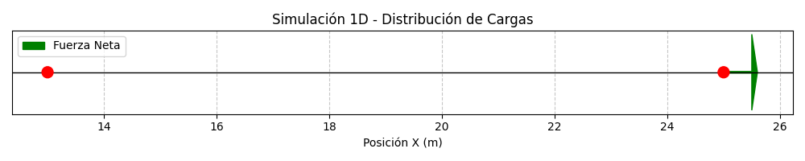
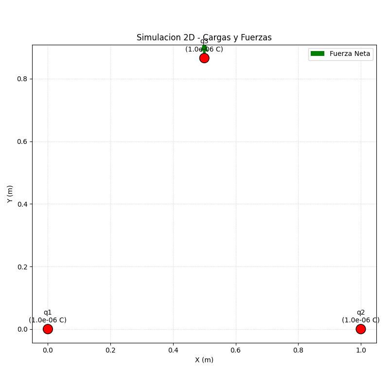
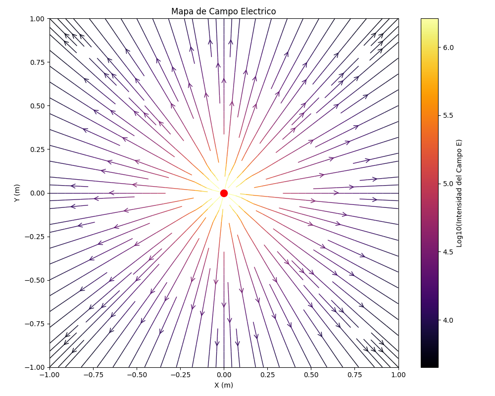

# Simulador Electrostático: Cargas, Fuerzas y Campos

**Estudiante:** Xavier Misael Armenta Muñoz  
**Asignatura:** Mecánica y Electromagnetismo  
**Carrera:** Ingeniería en Sistemas Computacionales  
**Fecha de entrega:** 02/06/2026

## 1. Descripción del Proyecto
Este simulador es una herramienta computacional desarrollada en Python para analizar sistemas de cargas eléctricas puntuales. Permite representar distribuciones de carga en una dimensión (1D) y dos dimensiones (2D), calculando de forma precisa las fuerzas de interacción mediante la Ley de Coulomb y el campo eléctrico resultante mediante el principio de superposición.

## 2. Tecnologías y Librerías Utilizadas
*   **Lenguaje:** Python 3.x
*   **NumPy:** Utilizada para el manejo de vectores, componentes rectangulares y cálculos de magnitudes.
*   **Matplotlib:** Empleada para la generación de visualizaciones estáticas, diagramas de fuerzas y mapas de campo eléctrico.
*   **Plotly:** Gráficos interactivos con zoom y hover para las visualizaciones 2D y mapas de campo.
*   **Streamlit:** Interfaz web interactiva con manipulación directa de cargas mediante arrastre.
*   **Dataclasses:** Para una representación estructurada y limpia del modelo de datos de las cargas.
*   **fpdf2:** Generación del reporte PDF.

## 3. Instrucciones de Instalación y Ejecución

### Requisitos previos
Tener instalado Python 3.8 o superior.

### Instalación
1. Clonar el repositorio o descargar la carpeta del proyecto.
2. Crear un entorno virtual (opcional pero recomendado):
   ```bash
   python -m venv venv
   source venv/bin/activate  # En Linux/Mac
   ```
3. Instalar las dependencias necesarias:
   ```bash
   pip install -r requirements.txt
   ```

### Ejecución

**Interfaz de línea de comandos:**
```bash
python main.py
```

**Interfaz web interactiva (Streamlit):**
```bash
streamlit run app.py
```
La interfaz web permite arrastrar las cargas directamente sobre el diagrama, ver la fuerza neta en tiempo real y generar mapas de campo eléctrico configurables.

## 4. Ejemplos de Uso
1.  **Modo 1D:** Ingrese 2 cargas sobre el eje X (ej. $q_1 = +2\ \mu\text{C}$ en $x = 0$, $q_2 = -2\ \mu\text{C}$ en $x = 1$). El sistema mostrará la fuerza de atracción y la dirección de los vectores.
2.  **Modo 2D:** Ingrese 3 cargas en un triángulo. Seleccione una carga para ver la fuerza neta resultante y su ángulo de inclinación.
3.  **Campo Eléctrico:** Defina puntos en el plano (ej. $(0,0)$, $(1,1)$, $(2,2)$) para obtener la magnitud y dirección del campo eléctrico total en esas coordenadas.

## 5. Explicación de los Cálculos Implementados

### Ley de Coulomb
Se calcula la fuerza entre cada par de cargas mediante:

$$
F = k \, \frac{|q_1 q_2|}{r^2}
$$

donde $k = 8.99 \times 10^9 \ \text{N} \cdot \text{m}^2 / \text{C}^2$. El simulador descompone automáticamente esta fuerza en sus componentes $F_x$ y $F_y$.

### Principio de Superposición
La fuerza neta $\vec{F}_{\text{neta}}$ sobre una carga se obtiene sumando vectorialmente todas las fuerzas individuales ejercidas por las demás cargas del sistema:

$$
\vec{F}_{\text{neta}} = \sum_i \vec{F}_i
$$

### Campo Eléctrico
Se calcula en cualquier punto del espacio sumando las contribuciones de cada carga $i$:

$$
\vec{E}_{\text{total}} = \sum_i k \, \frac{q_i}{r_i^2} \, \hat{r}_i
$$

## 6. Visualizaciones
El simulador genera automáticamente tres tipos de gráficos que se guardan en la carpeta `assets/screenshots/`:

### Caso 1D — Fuerza entre 2 cargas en el eje X

*Dos cargas positivas (rojo) separadas 1 m. La flecha verde indica la fuerza neta de repulsión sobre la carga seleccionada.*

### Caso 2D — Fuerza neta en triángulo equilátero

*Tres cargas positivas en triángulo equilátero. La fuerza neta sobre la carga superior es puramente vertical (Fx=0 por simetría).*

### Mapa de Campo Eléctrico

*Líneas de campo eléctrico generadas por una carga positiva en el origen. La intensidad se muestra en escala logarítmica (colores más claros = mayor intensidad).*

## 7. Validaciones
El programa incluye protecciones contra:
*   Entradas no numéricas.
*   Cargas en posiciones idénticas (división entre cero).
*   Cálculo de campo eléctrico exactamente sobre una carga.
*   Auto-interacción de cargas.
